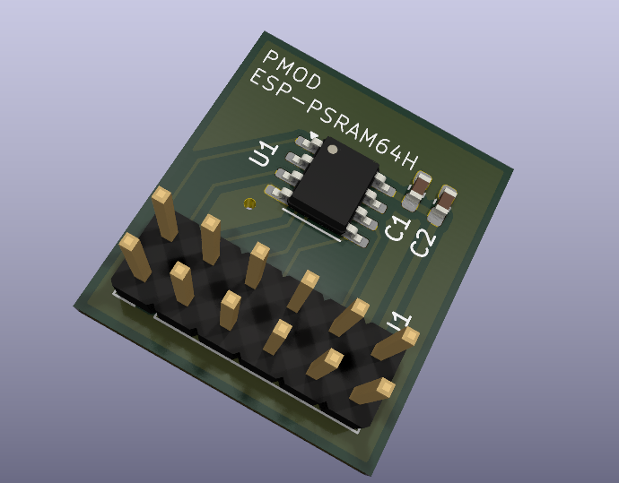
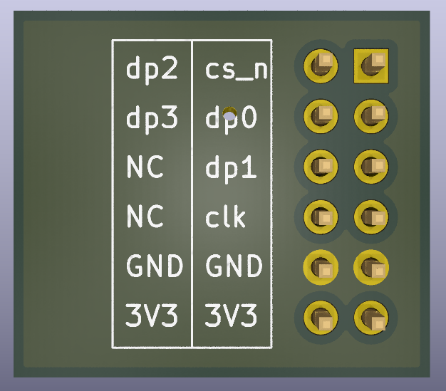

# ESP-PSRAM64H

A small PMOD(2x6 pins with 2.54mm pitch) PCB for ESP-PSRAM64H.

[ESP-PSRAM64 & ESP-PSRAM64H Datasheet](https://cdn-shop.adafruit.com/product-files/4677/4677_esp-psram64_esp-psram64h_datasheet_en.pdf)